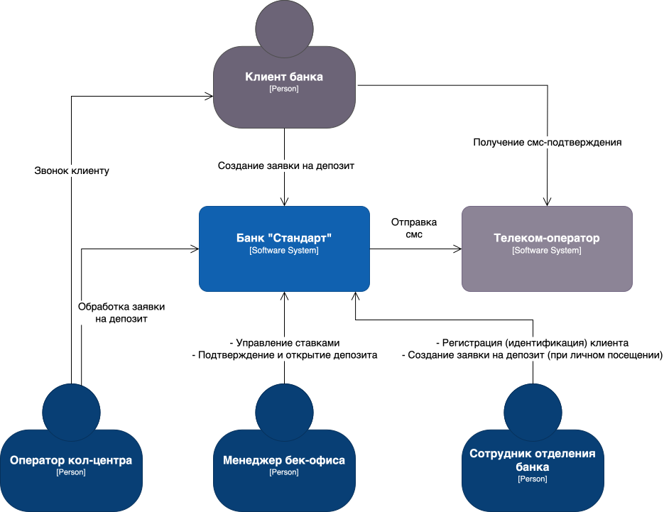
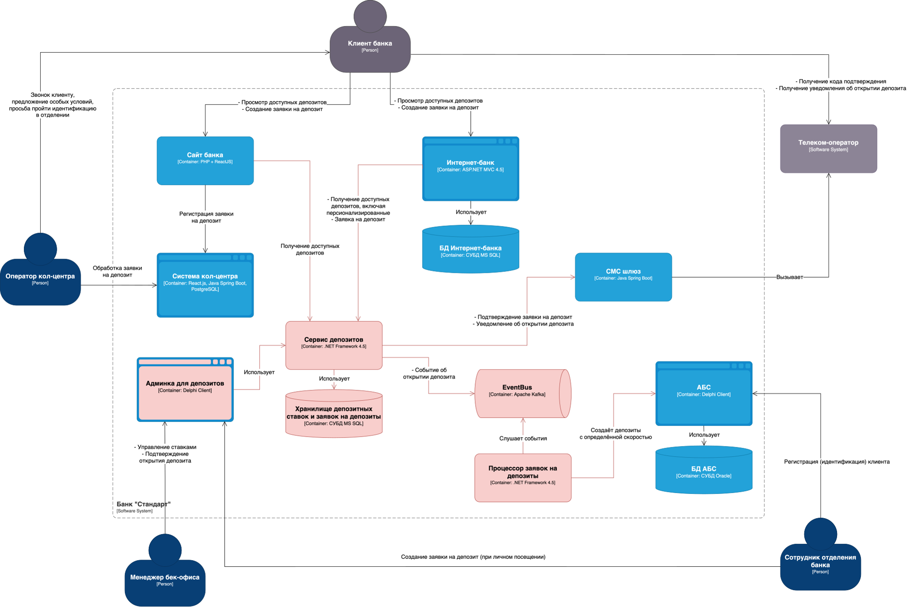

### **Название задачи:** 
Разработка MVP цифрового открытия депозитов для клиентов через сайт и интернет-банк

### **Автор:**
Команда цифровой трансформации

### **Дата:**
### **Функциональные требования**
Опишите здесь верхнеуровневые Use Cases. Их нужно оформить в виде таблицы с пошаговым описанием:

|**№**|**Действующие лица или системы**|**Use Case**|**Описание**|
| :-: | :- | :- | :- |
| 1 | Новый клиент, Сайт, Кол-центр | Подача заявки на депозит через сайт | Клиент оставляет ФИО и номер телефона. Заявка попадает в систему кол-центра. |
| 2 | Оператор кол-центра | Обработка заявки | Звонит клиенту, предлагает условия, создаёт заявку в АБС. |
| 3 | Новый клиент, Отделение банка | Прохождение идентификации | Клиент приходит в офис с документами. |
| 4 | Действующий клиент, Интернет-банк | Подача заявки на депозит | Клиент выбирает депозит, указывает счёт и сумму, подтверждает СМС |
| 5 | Бэк-офис, АБС | Подтверждение и открытие депозита | Сотрудник подтверждает ставку, создаёт депозит в АБС.|
| 6 | Система СМС, Клиент | Получение уведомлений | Клиент получает СМС об открытии депозита и условиях. |
| 7 | Сотрудник бэк-офиса, Веб/Desktop-интерфейс | Управление ставками | Ввод и изменение ставок по депозитам, сохранение в БД.|

### **Нефункциональные требования**
Опишите здесь нефункциональные требования и архитектурно-значимые требования.

|**№**|**Требование**|
| :-: | :- |
| 1 | HTTPS/шифрование трафика сайта и интернет-банка |
| 2 | Использование MS SQL / Oracle, Kafka (перспективно), .NET, React |
| 3 | Горизонтальное масштабирование интернет-банка |
| 4 | Изоляция нагрузки: интернет-банк не взаимодействует напрямую с API АБС |
| 5 | Время отклика UI — не более 200–300 мс; справочники — до 1 сек |
| 6 | Доступность 99.9%, работа 24/7, переключение на резервный ЦОД |
| 7 | Микросервисный подход, ограниченно – только модуль депозитов |
| 8 | Изоляция от ядра интернет-банка подрядчика (не трогаем) |
| 9 | Возможность расширения на мобильное приложение и другие продукты |

### **Решение**

#### C1

#### C2

- Создаём заявки на депозиты через отдельную очередь событий, дабы не убить AБС
- Выделили отдельный сервис, ответственный за депозиты
	- закрываем вопрос источника правды по ставкам
	- убираем зависимость на подрядчика в контексте доработки Интернет-банка
	- готовы к будущему масштабированию

**Недостатки, ограничения, риски**

1. В текущей реализации уведомление об успешном открытии депозита может придти раньше, чем депозит действительно откроется.
2. По-хорошему бы объединить депозитную админку с АБС клиентом, чтобы сохранить единое рабочее окно для менеджеров.

