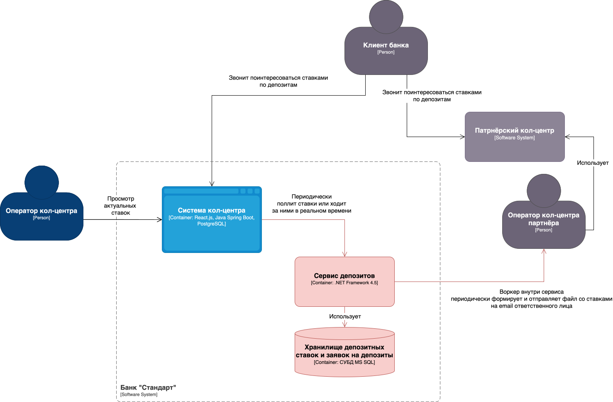

### **Название задачи:** 

Сделать ставки по депозитам доступными:

- для внутреннего кол-центра в их CRM-системе;

- для внешнего кол-центра – в виде экспортируемых файлов.

Предыдущее решение – [ADR.md](./../Task3/ADR.md)

### **Автор:**

Команда цифровой трансформации

### **Дата:**

2025.05.08

### **Функциональные требования**

|**№**|**Действующие лица или системы**|**Use Case**|**Описание**|
| :-: | :- | :- | :- |
| 1 | CRM кол-центра, Сервис депозитов | Просмотр актуальных ставок | Сотрудники кол-центра могут видеть ставки через API или UI |
| 2 | Сервис депозитов, Email ответственного лица из внешнего кол-центра | Передача ставок во внешний кол-центр | Формирование файла с актуальными ставками и передача партнёру по email |

### **Нефункциональные требования**
Опишите здесь нефункциональные требования и архитектурно-значимые требования.

|**№**|**Требование**|
| :-: | :- |
| 1 | Выгрузка ставок в файл для внешнего партнёра – минимум 1 раз в день (например, перед началом рабочего дня) формат XLSX/CSV |
| 2 | Только публичные ставки выгружаются и доступны внешним системам |
| 3 | Доступ к ставкам через защищённый API (аутентификация и авторизация) |

### **Решение**

1. Наш кол-центр интегрируем с мастер системой депозитных ставок напрямую.

2. Внешний кол-центр обогащаем информацией по ставкам через посылку email ответственному человеку.

**Недостатки, ограничения, риски**

1. Передача ставок во внешний кол-центр по файлам снижает актуальность данных и требует регламентации обмена.

2. Можно вынести воркер, формирующий файл для партнёров, в отдельный сервис.

